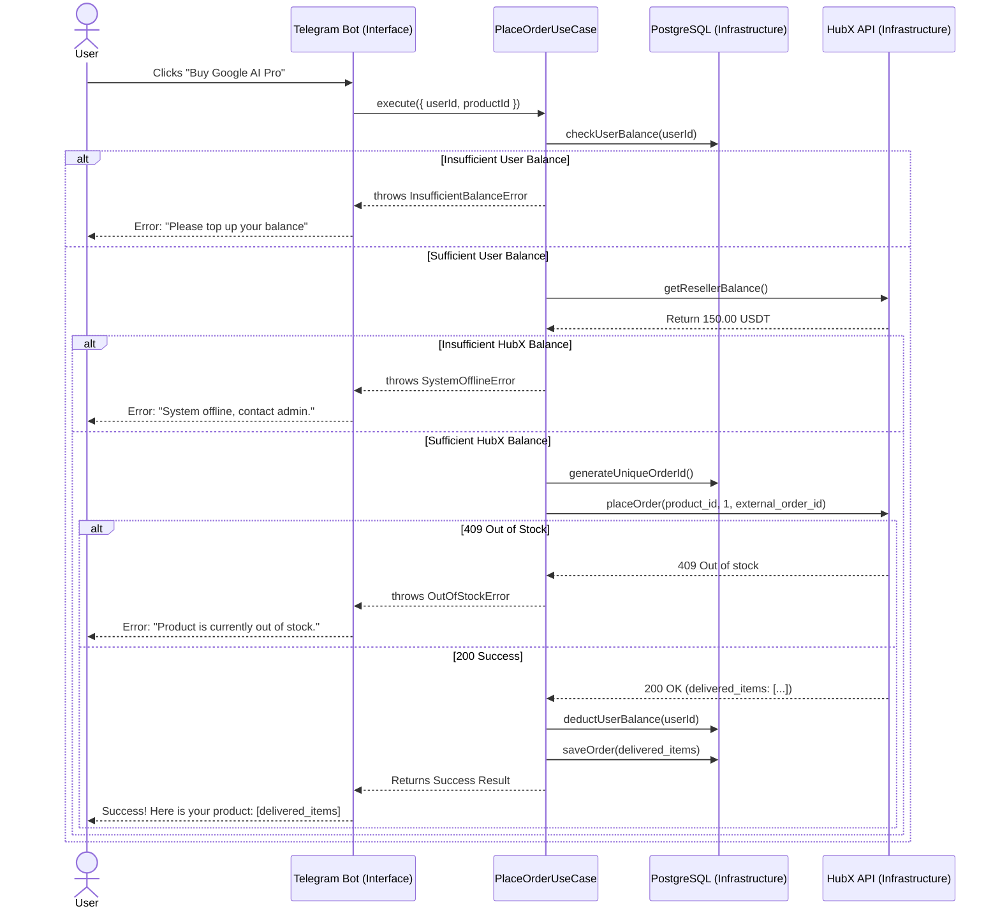

# HubX Digital Reselling Bot Implementation Plan

This document outlines the architecture, features, and implementation steps for building a digital reselling bot using the HubX Store Reseller API.

## Technical Decisions
> [!NOTE]
> Based on our discussion, we have finalized the following stack:
> - **Platform:** Telegram Bot (with future Web App capability)
> - **Architecture Pattern:** Clean Architecture (Domain-Driven Design / Ports & Adapters)
> - **Tech Stack:** Node.js, TypeScript, Telegraf (Telegram Bot Framework)
> - **Database:** PostgreSQL (using Prisma ORM)
> - **Cache:** Redis (for high-speed product caching and rate limits)
> - **Payments & Currency:** 
>   - **Currency:** Localized to Ethiopian Birr (ETB). HubX USDT prices will be converted to ETB using a configurable exchange rate.
>   - **Payment Flow:** Manual deposit via screenshot verification. Users send money (e.g., Telebirr/Bank), send a screenshot to the bot, and the admin approves it to fund their virtual wallet.

## Clean Architecture Overview

To ensure the codebase is enterprise-grade, highly testable, and prepared for the future Web App, we are using a strict **Clean Architecture**.

Business rules are completely isolated from the outside world (Telegram, PostgreSQL, Redis). The Telegram bot and Web API are merely "adapters" that trigger core "Use Cases".

### Project Folder Structure
```text
yeneshop/
├── prisma/
│   └── schema.prisma        # PostgreSQL database models
├── src/
│   ├── core/                  # 1. ENTERPRISE RULES (No external dependencies)
│   │   ├── entities/          # Data Models (User, Order, Product)
│   │   └── errors/            # Custom Domain Errors (e.g., OutOfStockError)
│   │
│   ├── use-cases/             # 2. APPLICATION RULES (Business Logic)
│   │   ├── order/             # e.g., PlaceOrderUseCase.ts
│   │   ├── deposit/           # e.g., ApproveDepositUseCase.ts
│   │   └── product/           # e.g., SyncProductsUseCase.ts
│   │
│   ├── infrastructure/        # 3. EXTERNAL TOOLS (The "Outside World")
│   │   ├── database/          # Prisma Repositories (UserRepository)
│   │   ├── cache/             # Redis Cache implementation
│   │   └── hubx/              # HubX API HTTP client
│   │
│   ├── interfaces/            # 4. ENTRY POINTS (How users interact)
│   │   ├── bot/               # Telegram Bot (Commands, Actions, Menus)
│   │   └── web-api/           # REST API routes (For future Web App)
│   │
│   ├── shared/                # Utilities, Logger, DI Container, Configs
│   └── index.ts               # Application entry point
├── .env
├── package.json
└── tsconfig.json
```

## How It Works: API Interaction Flow

Based on the documentation provided, here is the detailed sequence of how the bot will interact with the HubX Reseller API for a customer purchase.



## Proposed Features & API Integration

### 1. Pricing & Currency Localization
- **Exchange Rate Configuration:** The bot will store a configurable USDT-to-ETB exchange rate. 
- **Dynamic Pricing:** `(HubX USDT Cost * Exchange Rate) + Admin ETB Markup = Final Customer ETB Price`.

### 2. Manual Deposit System
- **Screenshot Upload:** Users send an image of their payment receipt to the bot.
- **Admin Approval Queue:** The bot forwards the receipt to the admin's Telegram account with "Approve/Reject" buttons.
- **Wallet Credit:** Upon admin approval, the user's virtual wallet is credited with ETB.

### 3. Product Management (`GET /products`)
- **Caching (Redis):** Fetch and cache the product list from HubX into Redis. This avoids hitting API rate limits and drastically improves the bot's response times.
- **Display:** Show active products, their current stock status, and your localized ETB prices to users via Telegram inline keyboards.
- **Auto-Sync:** Run a background cron job (e.g., every 5-10 minutes) to pull fresh data from HubX and update Redis.

### 4. Order Processing (`POST /orders`)
- **Payment Verification:** Ensure the user has sufficient ETB balance before initiating the HubX order.
- **Idempotency:** Generate a unique `external_order_id` (e.g., UUID or local database ID) for each customer order. This guarantees that if a network timeout occurs, retrying the order won't double-charge your HubX account.
- **Fulfillment:** Once the order succeeds, parse the delivered items from the API response and deliver them securely to the user in a private Telegram message.

### 5. Authentication & Onboarding
- **Seamless Auth:** The bot extracts `telegramId`, `username`, and `firstName` automatically via the Telegram payload without requiring passwords. The Web App uses the `initData` hash for secure validation, guaranteeing a completely frictionless 1-click onboarding experience.

## Web App UI & Design System (Future Phase)
When the React/Vite Web App is built, it will strictly follow native Telegram aesthetics to ensure a premium, integrated experience:
- **Colors:** Bind directly to Telegram CSS variables (e.g., `var(--tg-theme-bg-color)`, `var(--tg-theme-button-color)`).
- **Cards:** Thin, sharp borders (`0.5px solid rgba(0,0,0,0.1)`) with a tight, non-diffused downward drop shadow (`0 2px 4px rgba(0,0,0,0.05)`).
- **Buttons & Interactions:** Pill-shaped or heavily rounded buttons with CSS scale-down click effects (`transform: scale(0.97)`) and native Haptic Feedback vibrations using `Telegram.WebApp.HapticFeedback`.

## Database Schema (PostgreSQL) & Redis Cache

### PostgreSQL Models (via Prisma)
* **User:** `id`, `telegramId`, `firstName`, `username`, `avatarUrl`, `balanceETB`, `createdAt`, `updatedAt`
* **Deposit:** `id`, `userId`, `amount`, `screenshotUrl`, `status` (PENDING, APPROVED, REJECTED), `createdAt`
* **Order:** `id` (external_order_id), `userId`, `productId`, `status` (PENDING, PAID, COMPLETED, FAILED), `deliveredItems`, `hubxOrderId`, `createdAt`
* **Product:** `id`, `slug`, `name`, `stock`, `costPriceUSDT`, `sellingPriceETB`, `updatedAt`
* **Config:** `key` (e.g., `usdt_etb_rate`), `value`

### Redis Cache Structure
* **`hubx:products`**: Stores the JSON array of available products synced from HubX.
* **`hubx:sync:last_run`**: Timestamp of the last successful product sync.

## Implementation Phases

### Phase 1: Infrastructure & Core Setup
- Set up the Node.js/TypeScript project repository with Clean Architecture folders.
- Configure PostgreSQL (Prisma), Redis, and Dependency Injection container.

### Phase 2: Domain & Infrastructure Layers
- Define Core Entities and custom Errors.
- Implement Repositories (Database access) and external adapters (HubX API wrapper).

### Phase 3: Application Layer (Use Cases)
- Implement `SyncProductsUseCase`, `ApproveDepositUseCase`, and `PlaceOrderUseCase`.
- Write unit tests for the core Use Cases.

### Phase 4: Interface Layer (Telegram Bot)
- Connect Telegraf to the Use Cases.
- Implement the Mandatory Contact Sharing onboarding flow.
- Implement `/deposit` and the Admin Screenshot Approval flow.
- Implement checkout flow via Telegram UI in ETB.
