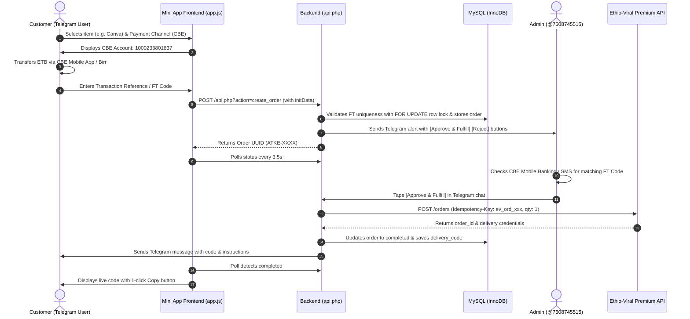

# Deploying Atke Digital Shop on Ethio Telecom Plesk Bronze Shared Hosting

This production deployment guide details how to host and configure the Telegram Mini App storefront and backend on **Ethio Telecom Plesk Bronze Shared Hosting** (`shop.atke.com.et`) without requiring Node.js, Composer, or background daemons.

---

## 🏗️ Architecture Overview

* **Hosting Target:** Ethio Telecom Plesk Bronze Shared Hosting
* **Domain:** `shop.atke.com.et` (SSL / HTTPS required for Telegram Mini Apps)
* **Backend:** Native PHP 8.1+ (PDO MySQL, cURL, zero third-party composer dependencies)
* **Database:** MySQL 8.x / MariaDB 10.x (InnoDB with row-level locking)
* **Fulfillment:** Ethio-Viral Premium API (`https://api.ethio-viral.com/v1/premium`)
* **Local Payment Channels:** Commercial Bank of Ethiopia (CBE), Telebirr / E-Birr, Kaafi

---

## 📋 File Layout

When deployed to Plesk's document root (`httpdocs/` for `shop.atke.com.et`), your files should be arranged as follows:

```text
httpdocs/
├── .env                         <-- Your live secret credentials (DB, Telegram, Ethio-Viral)
├── .htaccess                    <-- Security & CORS rules for Apache/Plesk
├── config.php                   <-- Core engine, DB connection, cURL helper, initData validator
├── api.php                      <-- Internal AJAX endpoint for Mini App
├── webhook.php                  <-- Telegram Webhook receiver (commands & admin approvals)
├── index.html                   <-- Mini App storefront UI
├── style.css                    <-- Telegram theme-reactive responsive styles
└── app.js                       <-- Mini App frontend controller & reconciler
```

---

## 🚀 Step 1: Create Database & User in Plesk

1. Log into your **Plesk Control Panel** (`https://your-server-ip:8443` or through Ethio Telecom portal).
2. Go to **Websites & Domains** > **Databases**.
3. Click **Add Database**.
   * **Database name:** `atke_shop` (or your preferred prefix)
   * **Related site:** `shop.atke.com.et`
   * **Database user name:** `atke_user`
   * **Password:** Generate a strong password (save this for `.env`)
   * Ensure **User has access to all databases within the selected subscription** is checked.
4. Click **OK**.
5. Once created, click **phpMyAdmin** next to the new database.
6. In phpMyAdmin:
   * Click on the database name on the left sidebar.
   * Go to the **Import** tab at the top.
   * Click **Browse / Choose File** and select `schema.sql` from this project.
   * Click **Go / Import** at the bottom.
   * Verify that tables `products_cache`, `users`, `orders`, and `system_settings` were created with pre-seeded items.

---

## 📁 Step 2: Upload Files via Plesk File Manager

1. In Plesk, go to **Websites & Domains** > **Files** (File Manager for `shop.atke.com.et`).
2. Navigate into the document root: **`httpdocs/`**.
3. Upload the following files from this repository:
   * `config.php`
   * `api.php`
   * `webhook.php`
   * `public_html/index.html` (upload directly into `httpdocs/index.html`)
   * `public_html/style.css` (upload directly into `httpdocs/style.css`)
   * `public_html/app.js` (upload directly into `httpdocs/app.js`)
   * `public_html/.htaccess` (upload directly into `httpdocs/.htaccess`)
4. Create the **`.env`** file:
   * In File Manager, click **+ (New File)** > name it `.env`.
   * Paste the configuration below (replace with your actual database password and API keys):

```ini
# Database Connection
DB_HOST=localhost
DB_PORT=3306
DB_NAME=atke_shop
DB_USER=atke_user
DB_PASS=YourActualDatabasePasswordHere

# Telegram Bot Credentials
BOT_TOKEN=8849880809:AAHwlV7suX-urb47VNorbuV-CEdbXtcJZ24
BOT_USERNAME=atke_shop_bot
ADMIN_TELEGRAM_IDS=7608745515
WEB_APP_URL=https://shop.atke.com.et/

# Ethio-Viral Premium API
ETHIO_VIRAL_API_URL=https://api.ethio-viral.com/v1/premium
ETHIO_VIRAL_API_KEY=your_ethio_viral_live_bearer_token

# Local Ethiopian Payment Channels
CBE_ACCOUNT=1000233801837
CBE_HOLDER=Mohammed Abdirahman Ibrahim

EBIRR_ACCOUNT=0906818924
EBIRR_HOLDER=Mohammed Abdirahman Ibrahim

KAAFI_ACCOUNT=0906818924
KAAFI_HOLDER=Mohammed Abdirahman Ibrahim
```

5. Click **Save**.

---

## ⚙️ Step 3: Verify PHP Version & Settings in Plesk

1. In Plesk, navigate to **Websites & Domains** > **PHP Settings** for `shop.atke.com.et`.
2. Select **PHP 8.1**, **8.2**, or **8.3** (run as FPM application served by Apache or Nginx).
3. Verify that the following standard PHP extensions are enabled (enabled by default in Plesk):
   * `curl`
   * `pdo_mysql`
   * `json`
   * `mbstring`
   * `openssl`
4. Click **Apply** / **OK**.

---

## 🔒 Step 4: Ensure SSL (HTTPS) is Active

Telegram Mini Apps strictly require a valid SSL certificate:
1. In Plesk, go to **Websites & Domains** > **SSL/TLS Certificates**.
2. If SSL is not active, click **Install** under Let's Encrypt, select `shop.atke.com.et`, and click **Get it free**.
3. Ensure **Redirect from HTTP to HTTPS** is enabled in **Hosting Settings**.

---

## 🤖 Step 5: Register Telegram Webhook URL

To connect your Telegram Bot to `webhook.php`:

### Method A: Via Browser
Open the following URL in your web browser (substitute your real `BOT_TOKEN`):
```text
https://api.telegram.org/bot8849880809:AAHwlV7suX-urb47VNorbuV-CEdbXtcJZ24/setWebhook?url=https://shop.atke.com.et/webhook.php
```

You should receive an instant JSON confirmation:
```json
{
  "ok": true,
  "result": true,
  "description": "Webhook was set"
}
```

### Method B: Via Terminal / cURL
```bash
curl -F "url=https://shop.atke.com.et/webhook.php" "https://api.telegram.org/bot8849880809:AAHwlV7suX-urb47VNorbuV-CEdbXtcJZ24/setWebhook"
```

### Verify Webhook Health:
```bash
curl "https://api.telegram.org/bot8849880809:AAHwlV7suX-urb47VNorbuV-CEdbXtcJZ24/getWebhookInfo"
```

---

## 🛍️ Step 6: Configure Telegram Mini App Menu Button

To display the persistent **"🛍️ Open Store"** button at the bottom of the chat:

### Option 1: Via @BotFather on Telegram
1. Open [@BotFather](https://t.me/BotFather) in Telegram.
2. Send `/setmenubutton`.
3. Choose your bot (`@atke_shop_bot`).
4. Enter the URL: `https://shop.atke.com.et/`
5. Enter the button label: `🛍️ Open Store`

*(Note: The `webhook.php` receiver also automatically registers this button whenever any user types `/start`)*

---

## 🔄 Step 7: Sync Products with Ethio-Viral Premium API

You can sync live products from Ethio-Viral at any time:

1. Open your browser or run via cURL:
   ```text
   https://shop.atke.com.et/api.php?action=sync_catalog
   ```
2. The endpoint will query `GET https://api.ethio-viral.com/v1/premium/products`, convert wholesale USD pricing to ETB with reseller margin, and update the `products_cache` table.

### Optional: Set Up Plesk Scheduled Task (Cron Job)
In Plesk > **Scheduled Tasks** > **Add Task**:
* **Task type:** Fetch a URL
* **URL:** `https://shop.atke.com.et/api.php?action=sync_catalog`
* **Cron expression:** `0 */4 * * *` (runs every 4 hours)

---

## 💳 Payment Reconciliation & Fulfillment Workflow



---

## 🛠️ Verification & Testing Checklist

- [ ] **Catalog browsing:** Open `https://shop.atke.com.et/` in your browser or Telegram. Product grid displays Canva, Coursera, ElevenLabs, etc.
- [ ] **Channel selection:** Click "Order Now" on an item. Switch between CBE, E-Birr, and Kaafi tabs. Account numbers and instructions update dynamically.
- [ ] **Copy button:** Click "Copy Account Number" to ensure clipboard copying works.
- [ ] **Order submission:** Enter a test transaction reference (e.g. `FT992384102`). Order is created, live tracking stepper opens.
- [ ] **Duplicate reference rejection:** Re-enter the same FT code. The system rejects it with an alert message.
- [ ] **Admin alert:** Verify that an interactive notification appears in the Telegram chat of Admin `7608745515`.
- [ ] **One-click fulfillment:** Tap `[✅ Approve & Deliver]`. Verify that the customer receives their digital voucher in both chat and the Mini App modal.

---

## ❓ Troubleshooting

| Issue | Cause | Resolution |
| :--- | :--- | :--- |
| **"Database connection failed"** | Incorrect DB name, user, or password in `.env` | Verify credentials in Plesk > Databases and match in `.env`. |
| **Telegram Mini App shows blank page** | SSL certificate missing or insecure URL | Ensure Let's Encrypt SSL is active and URL starts with `https://`. |
| **Admin buttons give "Unauthorized"** | Telegram user ID not listed in `ADMIN_TELEGRAM_IDS` | Send `/start` to `@userinfobot` to get your exact numeric ID, then add it to `ADMIN_TELEGRAM_IDS` in `.env`. |
| **"Idempotency-Key rejected"** | Reused key on Ethio-Viral API | `api.php` automatically generates a cryptographically unique key per order. Check error log in Plesk > Logs. |
